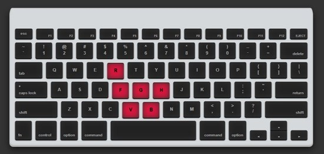

# Defcamp 2018 Quals: Message

  
  


## Description
I just typed this secret [message](/message.txt) with my new encoding algorithm. 

## Summary
Understand and solve the custom encoding algorithm

## Flag
```
DCTF{b66ecaaa90ad05df5dab33d71a8f70934408f3a5847a4c5c38db75891b0f0e32}
```

## Detailed solution
Opening the given encoded file, we observe that there is a lot of junk strings(*“qwerty”*, *“asdfgh”*, *“zxcvbn”*) that must be removed. After, we identify a **pair of brackets** inside that must be the hash.  
There are **digits**, that must be treated as such, and **sequences of characters**. After a lucky guess, we observe that this is a **drawing on the keyboard**. We made a webpage [index.html](highlight/index.html)(that takes a parameter key with this sequence and highlight them on a graphical animation of a keyboard) and a [script](decode.py)(that helps us with contruction of the flag).  

